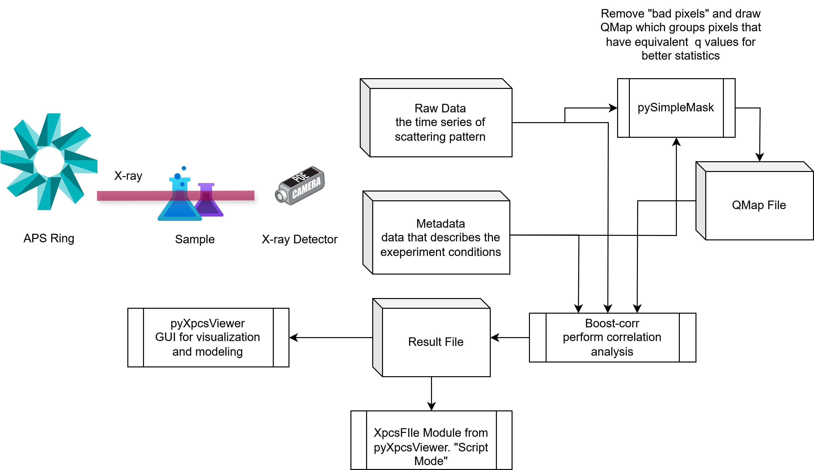

# poweruser

**Poweruser** is a collection of example scripts and Jupyter notebooks demonstrating the practical usage of pyXpcsViewer of XPCS result files, also known as "script mode". The result files are generated by the XPCS toolchains developped at the APS. A brief description of the workflow is shown in the following figure:



---
## Requirements

To run the examples:

```bash
pip install -r requirements.txt
```

## Start JupyterLab 
to start JupyterLab, run:

```bash
jupyter-lab
```

## Run the examples
navigate to the examples folder and run the scripts or notebooks.