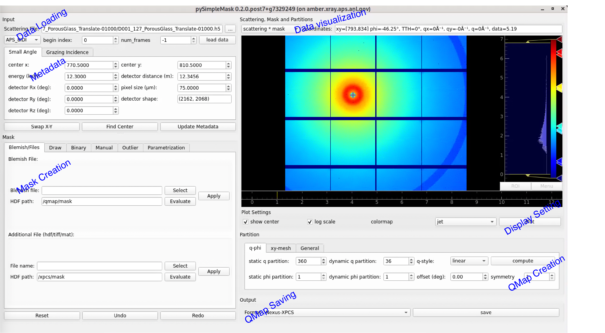

============================
Quick Guide on pysimplemask
============================

``pysimplemask`` is an interactive tool for mask and q-map creation, specifically designed to help users identify and remove bad pixels or regions in their data. This guide walks you through installation and basic usage.

Installation
============

``pysimplemask`` can be installed via pip. Before proceeding, ensure that you have `conda`, `miniconda`, or `miniforge` installed. If not, refer to the `Conda installation guide <software/installation_conda.rst>`_.

It is recommended to install ``pysimplemask`` in a dedicated conda environment to avoid conflicts:

.. code-block:: bash

    pip install git+https://github.com/AdvancedPhotonSource/pySimpleMask

Alternatively, you can clone and install the package manually:

.. code-block:: bash

    git clone https://github.com/AdvancedPhotonSource/pySimpleMask.git
    cd pySimpleMask
    pip install .

You may also obtain the latest single-file package (``.whl``) from your beamline contact:

.. code-block:: bash

    pip install path_to_pysimplemask.whl

Start the Application
=====================

To launch ``pysimplemask``, activate the environment where it was installed and run:

.. code-block:: bash

    pysimplemask
    pysimplemask --path PATH_TO_YOUR_DATA_FOLDER

If you're using linux machines at the APS beamlines, you can run 

.. code-block:: bash

    launch_simplemask
    launch_simplemask --path PATH_TO_YOUR_DATA_FOLDER

`lauch_simplemask` is a script that sets up the environment automatically.

Overview of the GUI Application
===============================

The GUI application is designed to be user-friendly with a clear layout

Typical Workflow
================

A typical workflow with ``pysimplemask`` includes:

1. **Select Beamline**: Choose the correct beamline preset.
2. **Load Data**: Navigate to and load the raw data file.
3. **Check Metadata**: Ensure metadata is correct and complete.
4. **Draw Mask**: Mask out bad regions (e.g., beamstops, streaks).
5. **Compute q-map**: Generate q-map based on scattering geometry.
6. **Save Results**: Export your mask and q-map for analysis.

Loading Data
============

After launching, select your beamline. For example, for XPCS at APS-8IDI, choose ``APS_8IDI``.

Next, select the appropriate raw data file (not the metadata file ending with ``_result.hdf``).

Detector Reference Table:

============  ======  ====================
Detector      Mode    Filename Pattern
============  ======  ====================
Eiger4M       fast    ``xxxxxx.h5``
Rigaku3M      fast    ``xxxxxx.bin.XYZ``
Rigaku3M      slow    ``xxxxxx.h5``
Rigaku500k    fast    ``xxxxxx.bin``
============  ======  ====================

For Rigaku3M (slow mode), select only ``.bin.000`` — the remaining ``.bin.XYZ`` files will be loaded automatically.

You may control the number of frames to load using the ``num_frames`` setting:

============  ==============================================
num_frames    Frames Loaded
============  ==============================================
-1            ``max(1000, total_frames // 5)`` (default)
0             All frames
N > 0         ``[start_index : start_index + N]``
============  ==============================================

Drawing Masks
=============

Once the data is loaded, you can begin defining masks to exclude bad pixels. XPCS analysis is highly sensitive to pixel artifacts, such as:

- Dead or hot pixels
- Saturated pixels
- Pixels obscured by beamstops, holders, or debris
- Scattering streaks from crystalline samples

Available masking methods include:

1. **Blemish Files**: Load predefined blemish files from ``~/Documents/areaDetectorBlemish/`` (available on APS Linux machines). These are automatically detected by ``pysimplemask``. You may load the mask defined in your earlier QMap file by select the file and set the HDF path to ``/qmap/mask``. 

2. **Manual Drawing**: Use drawing tools (rectangle, ellipse, polygon) to define custom masks. You can include or exclude regions interactively.

    .. image:: pysimplemask/figure2.png
       :align: center
       :width: 100%

    The black arrows indicate the resize/rescale handlers that users can use, while the white arrow indicates the center of the direct beam. ROIs can be moved by pressing the mouse button and dragging the ROI. The exclusive and inclusive ROIs are in solid and dashed lines, respectively.

3. **Binary Thresholding**: Define minimum and maximum intensity values to automatically mask regions outside the defined range.

4. **Manual Editing**: Add specific pixels or regions by inputting coordinates or clicking directly in the GUI. You may also set a radius for intensity-based region growing.

5. **Outlier Detection**: Automatically detect intensity outliers using percentile or Median Absolute Deviation (MAD) metrics.
    .. image:: pysimplemask/figure3.png
       :align: center
       :width: 100%

    The figure above illustrates the before and after of outlier detection using MAD. A threshold of 10 is set to mark the pixels whose value is more than 10 MADs away from the median value in the circularly averaged intensity profile. Note, this function is only useful for isotropic scattering data.

.. _internal_maps:

6. **Parametrization**: Use default or custom-generated maps to guide masking which allows flexible and precise control over the masking creation:
   - **phi**: Polar angle (°)
   - **TTH**: 2θ scattering angle (°)
   - **q**, **q_x**, **q_y**: Momentum transfer (1/Å)
   - **x**, **y**: Detector pixel coordinates

    .. image:: pysimplemask/figure4.png
      :align: center
      :width: 100%
    
    The figure above shows a custom mask created using both **phi** and **q** maps. The default mask being all ones is combined with 4 **phi** constraints that define a 60-degree sector. Than a **q** map constraint is appleid to limit the mask to 0.01 to 0.03 Å^-1 range. Note the use of logic operator is needed for combining multiple constraints.

Each masking method supports an **Evaluate → Apply** workflow. You can preview masks before applying, and undo/redo/reset as needed.

QMap Creation
=============

A QMap groups pixels by spatial position or q-value. Grouped pixels (or "q-bins") are assumed to share similar scattering vectors. This enhances statistical reliability in both static and dynamic analysis.

Steps for QMap creation:

1. Choose two orthogonal axes for binning:
   - Common choices: ``(q, phi)``, ``(x, y)``, or ``(q_x, q_y)``
   - Use ``General`` tab for arbitrary combinations

2. Specify the number of bins for:
   - **Static analysis**: Averaged intensity vs. q
   - **Dynamic analysis**: Time-resolved correlation

3. Choose binning mode:
   - Linear or logarithmic (only ``q`` supports log scale)

4. Click **Compute** to generate and preview the QMap

Fields saved in a QMap:

- ``static_roi_map``, ``dynamic_roi_map``: 2D integer maps
- ``static_v_list_dim0``, ``dynamic_v_list_dim1``: Value arrays
- ``static_num_pts``, ``dynamic_num_pts``: Bin count tuples
- ``static_index_mapping``, ``dynamic_index_mapping``: Index→value dicts
- ``mask``: Boolean mask array

Advanced Features
=================

Visualize all internal maps
---------------------------
In the "Scattering, Mask and Partitions" box, one can choose the different target to view. Currently, the supported targets include:
- **Scattering**: The original scattering pattern.
- **Scattering X mask**: The scattering pattern after applying the mask.
- **Mask**: The mask applied to the scattering pattern
- **qmaps**: defined in `previous section <#internal_maps>`

    .. image:: pysimplemask/figure6.png
        :align: center
        :width: 100%

    Example of visualizing different targets in the GUI.

Create QMap with symmetries
---------------------------
For scattering patterns with symmetry, QMap generation can incorporate symmetry constraints.

**Example**: For a sample with horizontal/vertical symmetry, set:

    - ``Symmetry = 2``
    - ``Offset = 45°`` to avoid discontinuities near 0°/360°

    .. image:: pysimplemask/figure5.png
       :alt: example 1
       :align: center
       :width: 100%

    The figure above illustrates how symmetry constraints can be applied to create a QMap the groups the horizontal/vertical regions as one bin. This is particularly useful when one wants to analyze both regions as a whole to increase the signal-to-noise ratio or to simplify the analysis process. Note, a 45-degree offset is necessary to avoid discontinuities near 0°/360°.

This ensures that symmetric pixel pairs are grouped into the same bin.

Authors
=======
- **Name**: Miaoqi Chu 
- **Email**: mqichu@anl.gov

- **Name**: Qingteng Zhang
- **Email**: qzhang234@anl.gov

Updated on: 2025-06-16
